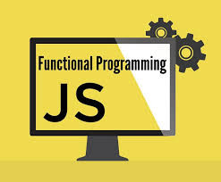

# Read 08 ~ Refactoring
> By Abdallah obaid

**NAME**     | **URL**
------------ | -------------
Home         | [Home](https://abdallah-obaid.github.io/reading-notes-301/).
 Read 01     | [SMACSS and Responsive Web Design](https://abdallah-obaid.github.io/reading-notes-301/class-01).
 Read 02     | [jQuery, Events, and The DOM](https://abdallah-obaid.github.io/reading-notes-301/class-02).
 Read 03     | [Flexbox and Templating](https://abdallah-obaid.github.io/reading-notes-301/class-03).
 Read 04     | [Responsive Web Design and Regular Expressions](https://abdallah-obaid.github.io/reading-notes-301/class-04).
 Read 05     | [Heroku Deployment](https://abdallah-obaid.github.io/reading-notes-301/class-05).
 Read 06     | [Node, Express, and APIs](https://abdallah-obaid.github.io/reading-notes-301/class-06).
 Read 07     | [APIs continued](https://abdallah-obaid.github.io/reading-notes-301/class-07).
 Read 08     | [SQL](https://abdallah-obaid.github.io/reading-notes-301/class-08).
 Read 09     | [Refactoring](https://abdallah-obaid.github.io/reading-notes-301/class-09).
 Read 10     | [The Call Stack and Debugging](https://abdallah-obaid.github.io/reading-notes-301/class-10).
 Read 11     | [EJS](https://abdallah-obaid.github.io/reading-notes-301/class-11).
 Read 12     | [Components](https://abdallah-obaid.github.io/reading-notes-301/class-12).
 Read 13     | [Update/Delete](https://abdallah-obaid.github.io/reading-notes-301/class-13).
 Read 14a    | [DB Normalization](https://abdallah-obaid.github.io/reading-notes-301/class-14a).
 Read 14b    | [Project Ideas & APIs](https://abdallah-obaid.github.io/reading-notes-301/class-14b).
 Read 15     | [Diversity and Inclusion](https://abdallah-obaid.github.io/reading-notes-301/class-15).

 
----------------------------------
# Refactoring JavaScript:-
----------------------------------
 * **There's a middle ground between speed and comprehension and that's where good code lives**.
 * Be explicit and throw an error so that problems can be spotted during development.
 * A hash function is used to map a given key to a location in the hash table. 
 * We can't go around writing functions for every option. Let's write one function that accepts a list of friendly things.
 
 ### Here are some straightforward to implement methods that can lead to easier to read code:-
 ----------------------------------
 > Return early from functions.
 > Cache variables so functions can be read like sentences.
 > Check for Web APIs before implementing your own functionality:

----------------------------------
# Functional programming:-
----------------------------------
* Functional programming is a programming paradigm — a style of building the structure and elements of computer programs — that treats computation as the evaluation of mathematical functions and avoids changing-state and mutable data.
*  Here is a very strict definition of purity:
> It returns the same result if given the same arguments (it is also referred as deterministic).
> It does not cause any observable side effects.
 