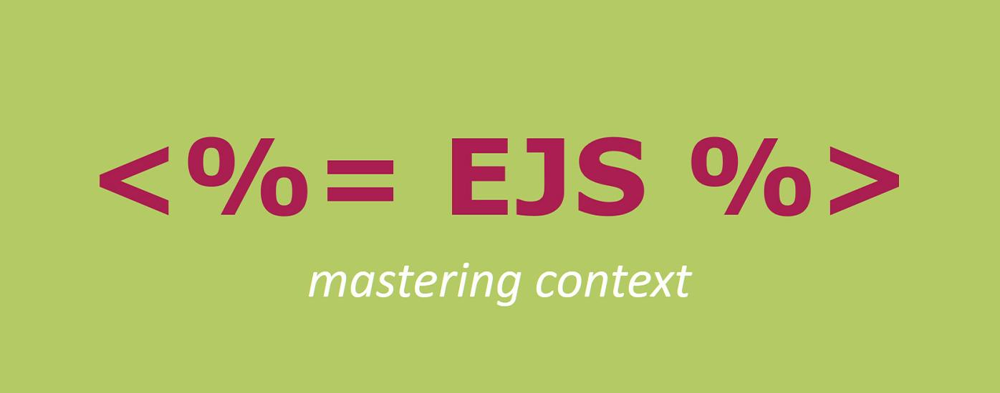

# Read 12 ~ Components
> By Abdallah obaid

**NAME**     | **URL**
------------ | -------------
Home         | [Home](https://abdallah-obaid.github.io/reading-notes-301/).
 Read 01     | [SMACSS and Responsive Web Design](https://abdallah-obaid.github.io/reading-notes-301/class-01).
 Read 02     | [jQuery, Events, and The DOM](https://abdallah-obaid.github.io/reading-notes-301/class-02).
 Read 03     | [Flexbox and Templating](https://abdallah-obaid.github.io/reading-notes-301/class-03).
 Read 04     | [Responsive Web Design and Regular Expressions](https://abdallah-obaid.github.io/reading-notes-301/class-04).
 Read 05     | [Heroku Deployment](https://abdallah-obaid.github.io/reading-notes-301/class-05).
 Read 06     | [Node, Express, and APIs](https://abdallah-obaid.github.io/reading-notes-301/class-06).
 Read 07     | [APIs continued](https://abdallah-obaid.github.io/reading-notes-301/class-07).
 Read 08     | [SQL](https://abdallah-obaid.github.io/reading-notes-301/class-08).
 Read 09     | [Refactoring](https://abdallah-obaid.github.io/reading-notes-301/class-09).
 Read 10     | [The Call Stack and Debugging](https://abdallah-obaid.github.io/reading-notes-301/class-10).
 Read 11     | [EJS](https://abdallah-obaid.github.io/reading-notes-301/class-11).
 Read 12     | [Components](https://abdallah-obaid.github.io/reading-notes-301/class-12).
 Read 13     | [Update/Delete](https://abdallah-obaid.github.io/reading-notes-301/class-13).
 Read 14a    | [DB Normalization](https://abdallah-obaid.github.io/reading-notes-301/class-14a).
 Read 14b    | [Project Ideas & APIs](https://abdallah-obaid.github.io/reading-notes-301/class-14b).
 Read 15     | [Diversity and Inclusion](https://abdallah-obaid.github.io/reading-notes-301/class-15).

 
----------------------------------
# EJS partial:-
----------------------------------
 * **Partials** come in handy when you want to reuse the same HTML across multiple views. Think of partials as functions, they make large websites easier to maintain as you don’t have to go and change a piece of text in every page it appears in. Instead, you define that reusable bundle of code in a file andinclude it wherever you need it.
 * We use <%- include( PARTIAL_FILE ) %> where the partial file is relative to the template you use it in.
 * Creating and including partials is very straightforward with EJS..
 
 # EJS Options:-
----------------------------------
* cache Compiled functions are cached, requires filename
* filename Used by cache to key caches, and for includes
* context Function execution context
* compileDebug When false no debug instrumentation is compiled
* client Returns standalone compiled function
* delimiter Character to use with angle brackets for open/close
* debug Output generated function body
* _with Whether or not to use with() {} constructs. If false then the locals will be stored in the locals object.
* localsName Name to use for the object storing local variables when not using with Defaults to locals
* rmWhitespace Remove all safe-to-remove whitespace, including leading and trailing whitespace. It also enables a safer version of -%> line slurping for all scriptlet tags (it does not strip new lines of tags in the middle of a line).
* escape The escaping function used with <%= construct. It is used in rendering and is .toString()ed in the generation of client functions. (By default escapes XML).
* outputFunctionName Set to a string (e.g., 'echo' or 'print') for a function to print output inside scriptlet tags.
* async When true, EJS will use an async function for rendering. (Depends on async/await support in the JS runtime.
 
  