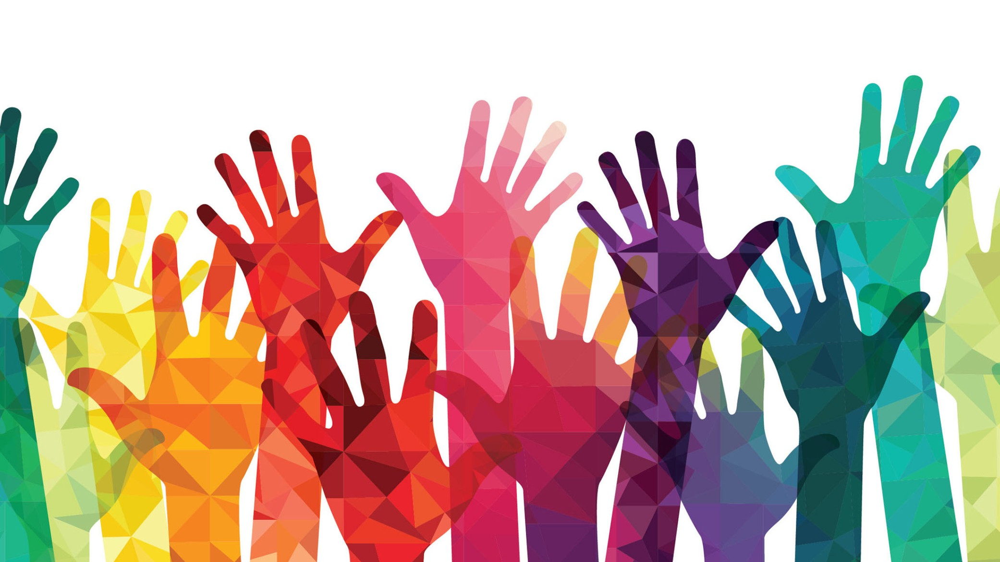

# Read 15 ~ Diversity and Inclusion
> By Abdallah obaid

**NAME**     | **URL**
------------ | -------------
Home         | [Home](https://abdallah-obaid.github.io/reading-notes-301/).
 Read 01     | [SMACSS and Responsive Web Design](https://abdallah-obaid.github.io/reading-notes-301/class-01).
 Read 02     | [jQuery, Events, and The DOM](https://abdallah-obaid.github.io/reading-notes-301/class-02).
 Read 03     | [Flexbox and Templating](https://abdallah-obaid.github.io/reading-notes-301/class-03).
 Read 04     | [Responsive Web Design and Regular Expressions](https://abdallah-obaid.github.io/reading-notes-301/class-04).
 Read 05     | [Heroku Deployment](https://abdallah-obaid.github.io/reading-notes-301/class-05).
 Read 06     | [Node, Express, and APIs](https://abdallah-obaid.github.io/reading-notes-301/class-06).
 Read 07     | [APIs continued](https://abdallah-obaid.github.io/reading-notes-301/class-07).
 Read 08     | [SQL](https://abdallah-obaid.github.io/reading-notes-301/class-08).
 Read 09     | [Refactoring](https://abdallah-obaid.github.io/reading-notes-301/class-09).
 Read 10     | [The Call Stack and Debugging](https://abdallah-obaid.github.io/reading-notes-301/class-10).
 Read 11     | [EJS](https://abdallah-obaid.github.io/reading-notes-301/class-11).
 Read 12     | [Components](https://abdallah-obaid.github.io/reading-notes-301/class-12).
 Read 13     | [Update/Delete](https://abdallah-obaid.github.io/reading-notes-301/class-13).
 Read 14a    | [DB Normalization](https://abdallah-obaid.github.io/reading-notes-301/class-14a).
 Read 14b    | [Project Ideas & APIs](https://abdallah-obaid.github.io/reading-notes-301/class-14b).
 Read 15     | [Diversity and Inclusion](https://abdallah-obaid.github.io/reading-notes-301/class-15).

 
----------------------------------
# Diversity and Inclusion in the workspace:-
----------------------------------
* **Diversity** efforts are most successful when they’re driven by a commitment from company leaders, And meaningful commitment requires leaders to understand why diversity matters.
* Studies indicate that **diversity offers significant benefits for teams focused on creativity and innovation**.
* "Diverse groups of people bring to organizations more and different ways of seeing a problem and, thus, faster/better ways of solving it." by Scott E. Page.
* At Intel, CEO Brian Krzanich has said: "A fully diverse and inclusive workplace is fundamental to our ability to innovate and deliver business results."
* Failing to attract and hire employees from underrepresented backgrounds leads companies to **miss out on incredible talent**.
* **Diverse companies can better serve a diverse user base**

  